# Дневник эмоций — гайд

Минималистичный трекер настроения. Записывайте эмоции, ставьте интенсивность для каждой, ведите дневник, смотрите статистику и не забывайте отмечаться по своим напоминаниям.

## Что приложение умеет

  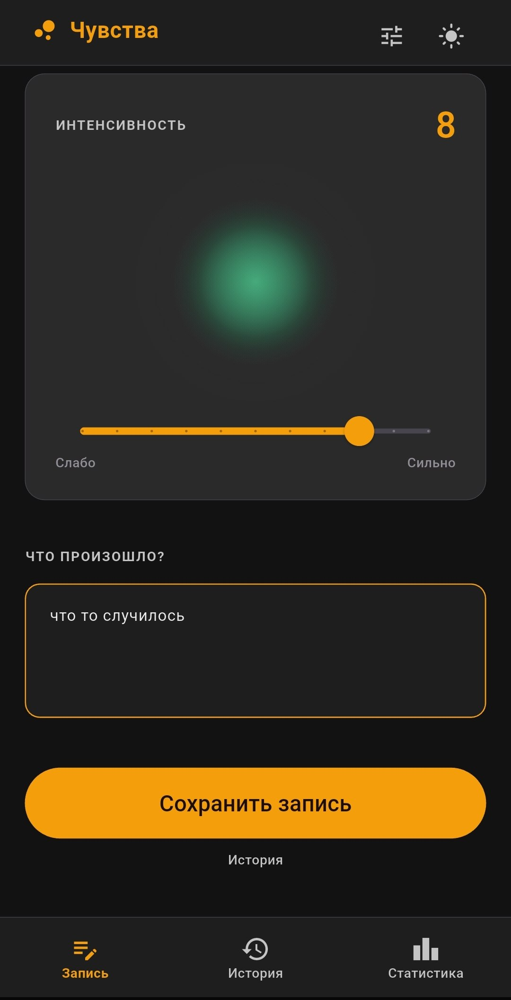
  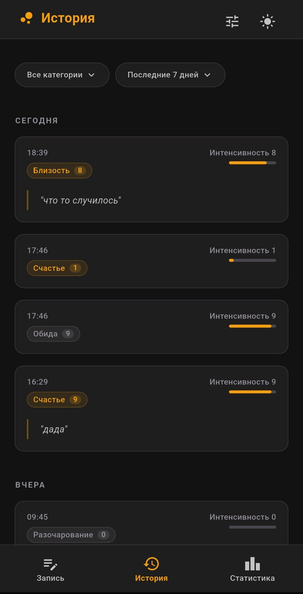
  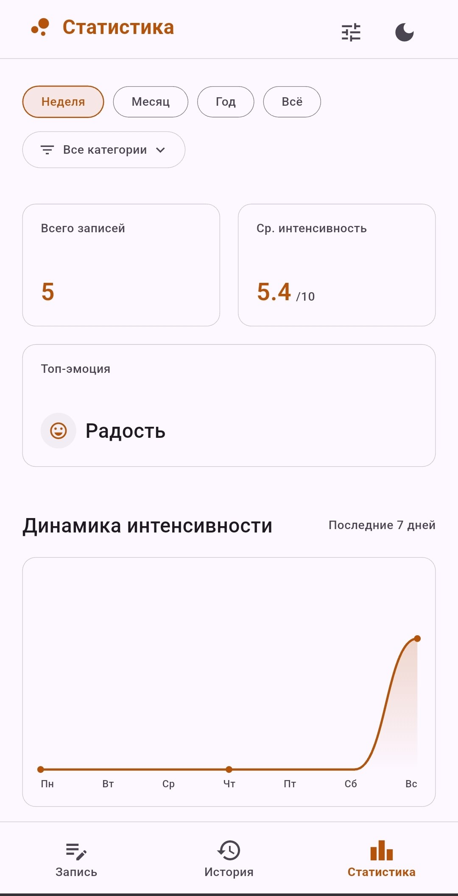

Слева направо: запись новой эмоции с интенсивностью, дневник прошлых записей, статистика (здесь — на светлой теме, чтобы было видно, что у приложения две темы и настраиваемый акцентный цвет).

Основное:

- **Запись** — выбираем эмоцию (или несколько), для каждой ставим интенсивность 0–10, пишем контекст.
- **История** — все записи сгруппированы по дням, с фильтрами по категории и периоду. Любую запись можно открыть, отредактировать или удалить.
- **Статистика** — топ-эмоция, средняя интенсивность, недельный график, частота, контекст, donut по типам эмоций. Фильтруется по периоду и по категории.
- **Напоминания** — любое количество, со своим текстом, временем и периодичностью.
- **Настройки** — тема, язык (ru/en), акцентный цвет, управление списком эмоций, экспорт/импорт CSV, ссылка на исходники.

---

## Запись эмоции

- Дата/время в верхней карточке — по умолчанию «Сейчас», тап открывает date + time picker (см. ниже).
- Блок **Текущие эмоции** → тап `+` открывает каталог.
- **Что произошло?** — свободный текст, любые свои пометки/триггер.
- **Сохранить запись** — кладёт запись в дневник.

### Выбор даты и времени

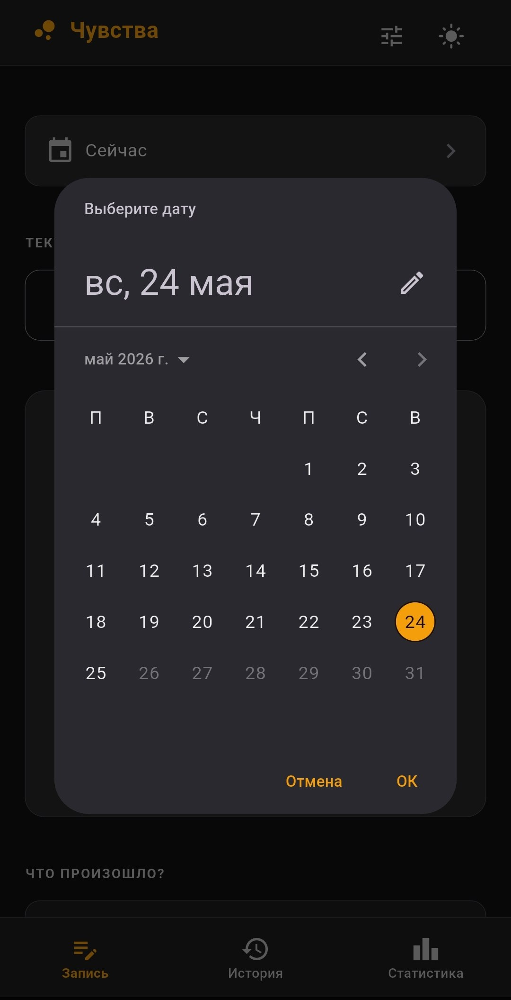

Стандартный системный диалог. Сначала календарь, потом часы/минуты.

### Каталог эмоций

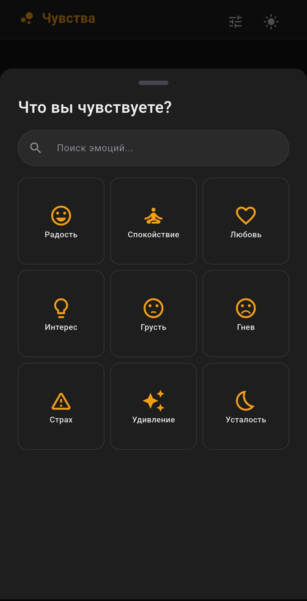

- 9 категорий: радость, спокойствие, любовь, интерес, грусть, гнев, страх, удивление, усталость.
- Поле сверху ищет и по названиям категорий, и по конкретным эмоциям (на текущем языке и на английском).

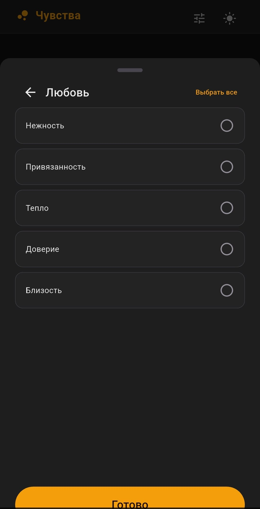

- Внутри категории — список конкретных эмоций. Чек-боксы, можно несколько.
- Сверху справа — «Выбрать все».
- Снизу — «Готово», возвращается на экран записи с уже выбранными.

### Интенсивность

При одной эмоции — один большой ползунок. Цвет визуализации непрерывно меняется в зависимости от интенсивности и валентности (позитив = зелёный, негатив = красный, нейтрал = акцентный):

  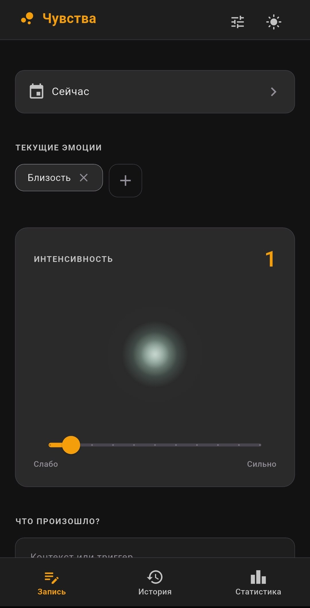
  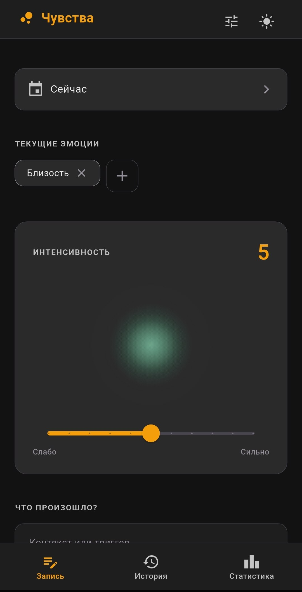
  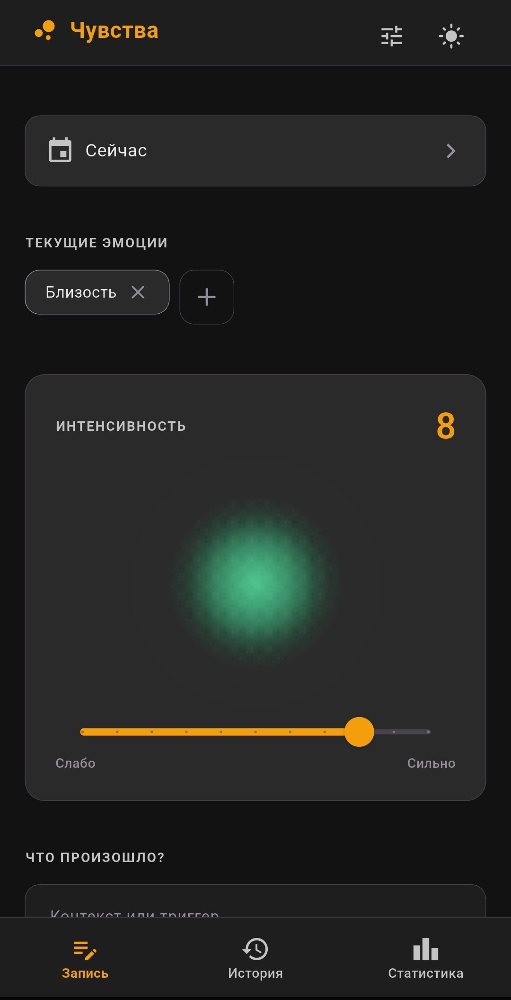

Слева направо: 1 (бледный, маленький пузырь) → 5 (средний) → 8 (насыщенный, крупный).

> При двух и более выбранных эмоциях большой ползунок заменяется на отдельные слайдеры под каждую эмоцию. Общая интенсивность считается как среднее.

---

## История

- Группировка по дням: «Сегодня», «Вчера», явная дата.
- Сверху чипы: фильтр по категории + период (7 / 30 / 365 / всё время).
- В каждой карточке: время, цветные «пилюли» эмоций с их собственной интенсивностью, общая интенсивность справа, цитата триггера.

### Фильтр по категории

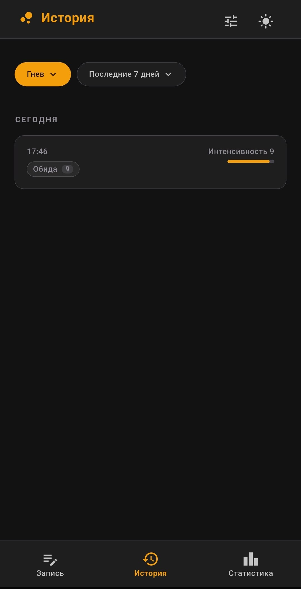

Чип «Все категории» → выбираете «Гнев» → остаются только записи с эмоциями из этой категории.

### Редактирование и удаление записи

**Тап** по любой карточке открывает её в режиме редактирования (тот же экран записи, но с предзаполненными полями + кнопкой корзины в шапке). Меняете что нужно → «Сохранить изменения». Кнопка корзины — удаление с подтверждением.

---

## Статистика

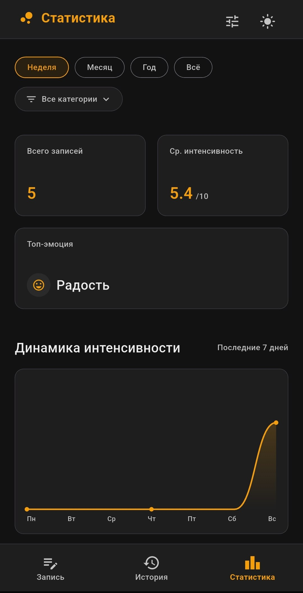

- Селектор периода: неделя / месяц / год / всё.
- Фильтр по категории — пересчитывает все метрики ниже под выбранную категорию.
- **Всего записей** + **Средняя интенсивность** + **Топ-эмоция**.
- **Динамика интенсивности** — линия по последним 7 дням, пропуски сглаживаются.

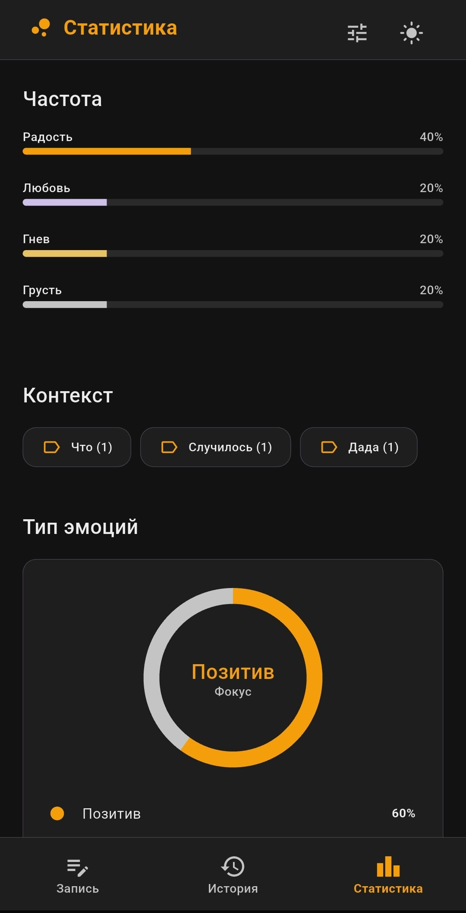

- **Частота** — топ-4 категории в процентах.
- **Контекст** — самые частые слова из триггеров с количеством упоминаний.
- **Тип эмоций** — donut с долями позитив/нейтрал/негатив, в центре доминирующая «фокус»-валентность.

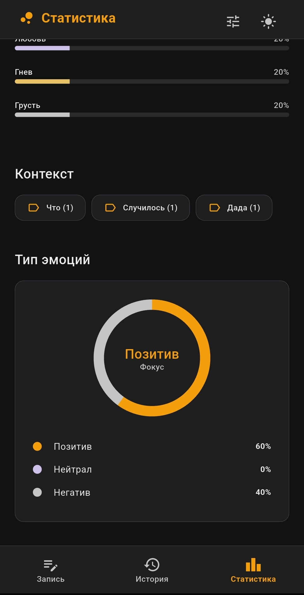

Прокрутив вниз, видно полную легенду с процентами по всем трём валентностям.

### Светлая тема vs тёмная

То же содержимое, что и `stats_top.png` выше, но на светлой теме. Тема переключается из Настроек → Внешний вид → Тема.

---

## Настройки

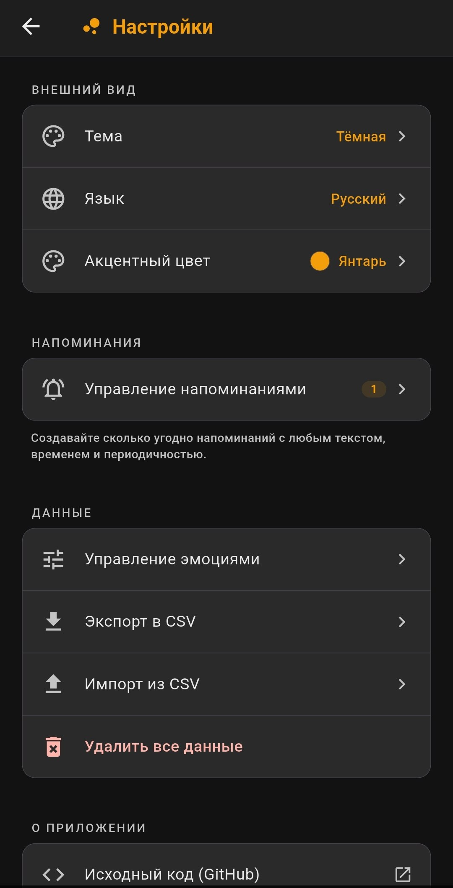

- **Внешний вид**
  - Тема: светлая / тёмная / системная.
  - Язык: русский / English.
  - Акцентный цвет: индиго / бирюза / роза / янтарь / изумруд / графит. Меняет цвет всех акцентов (на скрине выбран янтарь).
- **Напоминания** → переход в управление (см. ниже). Цифра справа — сколько активных напоминаний.
- **Данные**
  - Управление эмоциями.
  - Экспорт в CSV (через системный share).
  - Импорт из CSV.
  - Удалить все данные (с подтверждением).
- **О приложении** → исходный код на GitHub.

Все настройки сохраняются автоматически — после перезапуска приложения вы видите ту же тему, акцент, язык и список напоминаний.

---

## Напоминания

Открываются из Настроек → «Управление напоминаниями». На основном экране списка — карточки с текстом, временем, периодичностью и переключателем вкл/выкл; справа снизу `+` для нового напоминания.

### Создание / редактирование

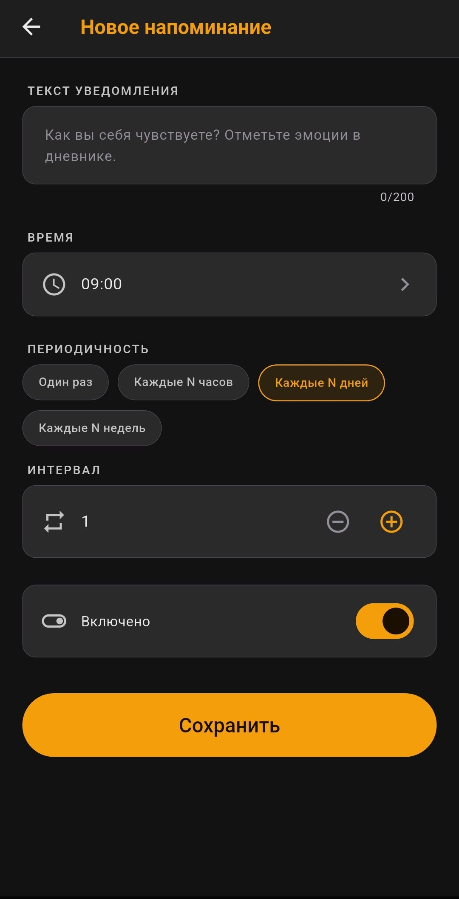

- **Текст уведомления** — что появится в шторке. Есть дефолт по умолчанию, если поле пустое. Лимит 200 символов.
- **Время** — час и минута через системный time picker.
- **Периодичность**: один раз / каждые N часов / каждые N дней / каждые N недель.
- **Интервал** — степпер N для периодических напоминаний (от 1 до 365).
- **Включено** — переключатель, дублирует свитч в списке.
- **Сохранить**.

> Уведомления работают через системный планировщик Android. На некоторых производителях (Xiaomi, Huawei, Realme) ОС может убивать фоновые задачи — на самой странице напоминаний показывается жёлтая плашка с предупреждением и советом добавить приложение в автозапуск + снять ограничения батареи.

---

## Управление эмоциями

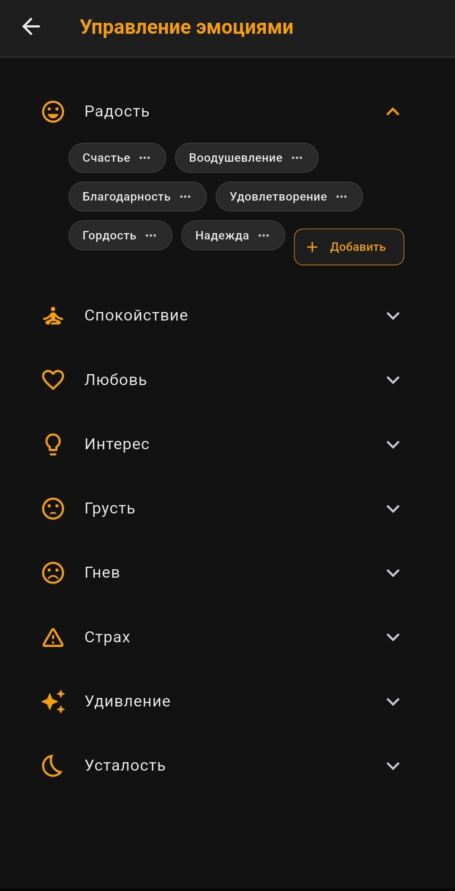

Открывается из Настроек → Данные → Управление эмоциями.

- Все 9 категорий, тап по строке — раскрытие списка эмоций.
- Каждая эмоция — чип. Тап по чипу → меню «Переименовать / Удалить».
- Кнопка «+ Добавить» в каждой категории — для своих эмоций.

### Меню чипа

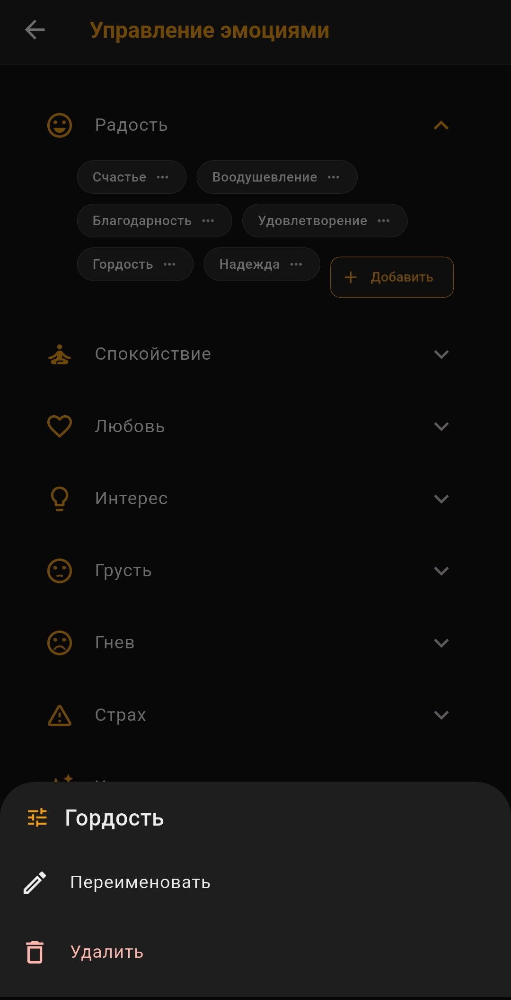

Снизу выезжает sheet с двумя действиями:

- **Переименовать** — открывает поле ввода с текущим именем.
- **Удалить** — с подтверждением.

> Удалённые **базовые** эмоции скрываются из выбора, но **остаются в прошлых записях** в исходном виде — история не переписывается задним числом.

### Добавление новой эмоции

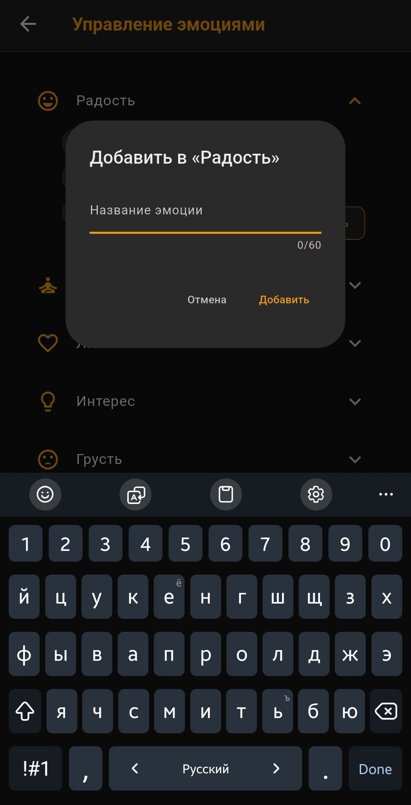

«+ Добавить» открывает диалог с полем ввода (лимит 60 символов). Кастомная эмоция сохраняется в выбранной категории и доступна в каталоге наравне с базовыми. Можно удалять и переименовывать так же, как любую другую.

---

## CSV-формат (импорт/экспорт)

Колонки: `id, timestamp, emotions, intensity, trigger`

- `timestamp` — ISO-8601.
- `emotions` — список через `;`, каждая запись = `name|categoryId|valence|intensity`. Старый трёхчастный формат без интенсивности тоже понимается (intensity ← общая).
- `intensity` — общая интенсивность строки 0..10 (среднее по эмоциям).
